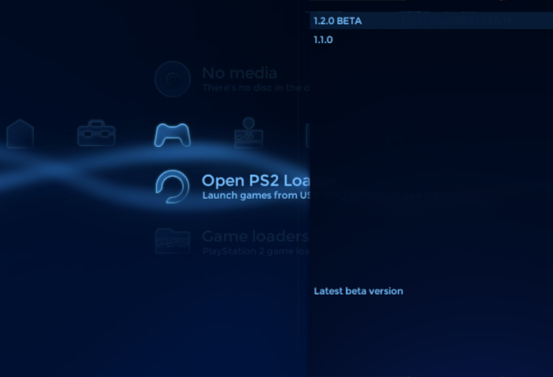

# ContextMenu plugin for XEB+ Xmas Showcase

Latest version: **1.3 (2025-03-16)**  

## What is ContextMenu plugin?  

ContextMenu plugin allows you to group applications in context menus in XtremeEliteBoot+ (Xmas Showcase).  
You can create as many context menus as you want.  

## How to use ContextMenu plugin?  

1. Extract content of **ContextMenu_1.3.zip** (or other file if you download older version) in the XEBPLUS folder.  
2.  To change context menu content just edit PLG file (versions 1.3).  
    In older versions, context menu content can be changed in lua file in context menu folder.  
    Examples and instructions will be added later, but I think PLG file explains itself.  

## Credits:

Plugin coded by: xGamereqPL  

## Changelog:  

**ContextMenu 1.3 - 16.03.2025**:  
- now context menu reads its content from PLG files, so it requires only one ContextMenu.lua file  
- changed context menu configuration syntax  
- added support for .Loader, .IOPReset and .IOPDisc parameters to improve compatibility with ELF applications  
- added support for LUA items, now context menu can have both ELF and LUA applications
- added support for comments (up to 5 lines of text in the bottom of the context menu), different for each context menu item  
- cleaned code  
- fixed bugs  

**ContextMenu 23-04-2023 - 23.04.2023**:  
- first release  
