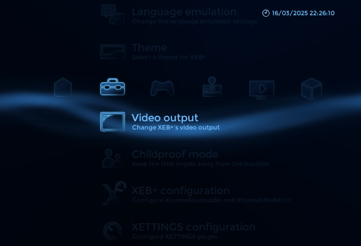

# XEB+ plugins collection

Here you can download my plugins for XtremeEliteBoot+ Xmas Showcase.  

  

**XETTINGS plugin** - plugin that allows to change XEB+ settings directly from the dashboard  

**SubMenu plugins** - plugin that creates submenu with group of applications, for example file managers  

**ContextMenu plugins** - plugin that creates context menu with group of applications, for example different versions of application  

## Credits & Thanks
- Howling Wolf & Chelsea – XEB+ development, advice
- Berion – graphic design, feedback
- nuno6573 – testing, translations
- P4NCHOL1NO – testing, translations
- MayconTp – translations
- everyone who contributed to the XEB+ and these plugins