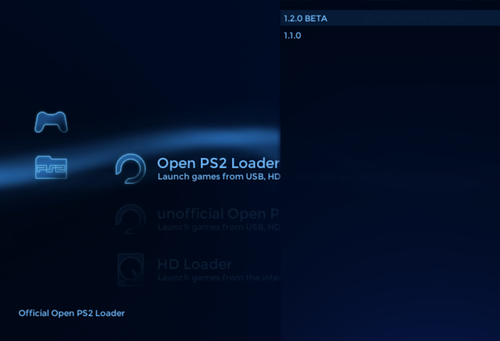

# SubMenu plugin for XEB+ Xmas Showcase

Latest version: **1.3.1 (2025-04-07)**  

## What is SubMenu plugin?  

SubMenu plugin allows you to group applications in submenus in XtremeEliteBoot+ (Xmas Showcase).  
You can create as many submenus as you want.  

## How to use SubMenu plugin?  

1. Extract content of **SubMenu_1.3.1.zip** (or other file if you download older version) in the XEBPLUS folder.  
2.  To change submenu content just edit PLG file (versions 1.3.1 and 1.3).  
    In older versions, submenu content can be changed in lua file in submenu folder.  
    Examples and instructions will be added later, but I think PLG file explains itself.  

## Credits:

Plugin coded by: xGamereqPL  

## Changelog:  

**SubMenu 1.3.1 - 07.04.2025**:  
- added support for "item without icon" (for example error message)  
- removed unused stuff from code  
- fixed graphical bug with item comments  

**SubMenu 1.3 - 16.03.2025**:  
- now submenu reads its content from PLG files, so it requires only one SubMenu.lua file  
- changed submenu configuration syntax  
- added support for comments (up to 2 lines of text in the left bottom corner), different for each submenu item  
- added support for .Loader, .IOPReset and .IOPDisc parameters to improve compatibility with ELF applications  
- added support for ContextMenu items instead of MultiELF - now context menu supports ELF and LUA applications  
- added support for comments (up to 5 lines of text in the bottom of the context menu), different for each context menu item  
- cleaned code  
- fixed bugs  

**SubMenu 1.2 - 19.05.2023**:  
- added checking if file exist before launching  
- added LuaScript support  
- added MultiELF support (version selection)  
- fixed some issues  

**SubMenu 1.1 - 28.03.2023**:  
- updated functions  
- new icon/description loading script (now works as it should)  
- code cleanup (the file is now smaller by 2 kB, unused code fragments have been removed)  

**SubMenu 1.0 - 25.02.2023**:  
- first release  
