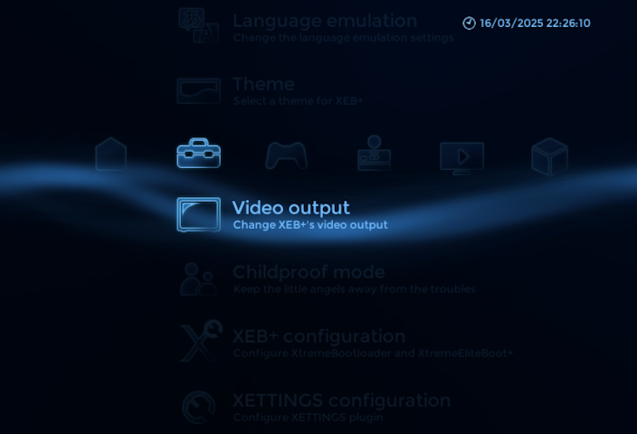

# XETTINGS plugin for XEB+ Xmas Showcase

Latest version: **1.3.1 (2025-03-30)**  

## What is XETTINGS?  

XETTINGS is a plugin for XtremeEliteBoot+ (Xmas Showcase).  
Allows you to change XEB+ settings directly from the dashboard.  
This feature has been removed from the Xmas Showcase, but you can bring it back with this plugin.  
You also can change XtremeBootloader settings (USB Drivers) that cannot be changed in xebplus.cfg.  
This plugin also adds some custom features, like more date formats.  

## How to install XETTINGS?  

Extract content of **XETTINGS_1.3.1.zip** (or other file if you download older version) in the XEBPLUS folder.  

## Warnings:

Use this plugin only with XEB+ Xmas Showcase.  
Do not use this plugin if you run XEB+ from host:/ (PCSX2), it will corrupt the CFG file (but it seems to work with the latest nightly PCSX2 version).  
Exit to Browser only works on some console models (I can confirm it works on SCPH-50004 - ROMVER 1.70)  
After changing the USB Drivers, the options saves to mc?:/BOOT/XBL.CNF or mc?:/SYS-CONF/XBL.CNF (only if the BOOT or SYS-CONF folder exists). In case of problems after changing the drivers, delete this file.  

## Credits:

Plugin coded by: xGamereqPL  
Spanish translations: Howling Wolf & Chelsea, P4NCHOL1NO  
Portuguese translations: MayconTp, nuno6573  

## Changelog:  

**XETTINGS 1.3.1 - 30.03.2025**:  
- cleaned submenu code  
- fixed bug: when theme previews were disabled, they were still displayed in "theme settings" submenu  
- fixed bugs with saving XBL.CNF file  

**XETTINGS 1.3 - 16.03.2025**:  
- updated ContextMenu and SubMenu  
- updated translations  
- theme: new theme selection menu with smoother previews and improved sorting script  
- theme: added "Loading themes list..." and "Loading theme preview..." texts  
- video mode: fixed issues in "confirm video mode" screen  
- date format: added new date formats (MM-DD-YYYY, DD-MM-YYYY, MM.DD.YYYY, DD.MM.YYYY)  
- USB drivers: moved warning text to the left (like in Default IOP reset method)  
- USB drivers: added new XBL.CNF path - mc?:/BOOT/XBL.CNF  
- added XETTINGS configuration submenu  
- XETTINGS configuration: added Loading themes list progress  
- XETTINGS configuration: added Theme preview settings  
- XETTINGS configuration: added Configure "Exit to browser"  
- added function to display theme selection menu in submenu, useful in "theme settings" submenus  
- changed some texts  
- cleaned code  
- fixed bugs  

**XETTINGS 1.2 - 22.05.2023**:  
- context menu coded from scratch (now uses fontSmall)  
- theme preview fades out smoother  
- added exit code to the childproof mode context menu  
- changed context menu texts position  
- bug fixes    

**XETTINGS 1.1 - 22.04.2023**:  
- updated "Refresh" option.  
- renamed "Exit to Browser" to "Restart" to better describe what it does  
- moved "Disc launch behavior", "Date format", "Type of clock" and "Default IOP reset method" settings to "XEB+ Configuration" submenu  
- added real "Exit to Browser" [EXPERIMENTAL]  
- added "USB Drivers" (to the submenu) [EXPERIMENTAL]  
- added themes list scrolling  
- moved theme info to the left screen side (under the preview)  
- added video mode change confirmation  
- moved xebplus.cfg saving function to PLG_XETTINGS.lua  
- fixed some issues    

**XETTINGS 1.0 - 22.03.2023**:  
- first release  
